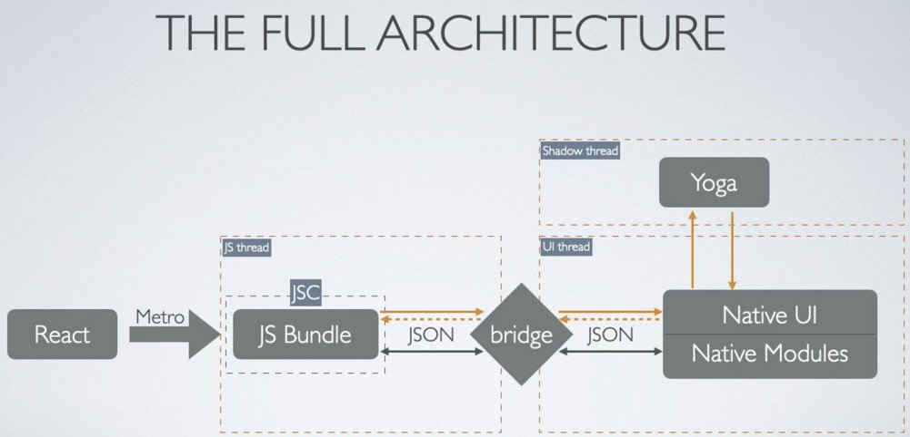
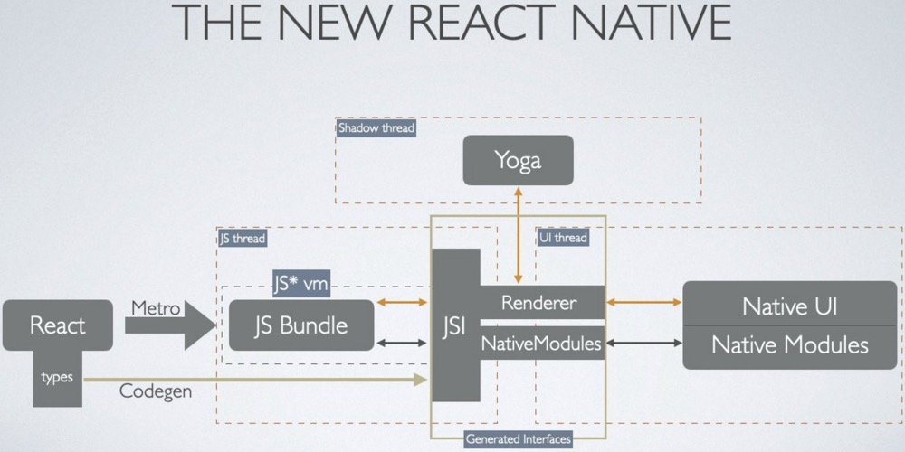

### React Native's re-architecture in 2020

> 如何大幅改善应用程序性能

2015 年 Facebook 发布了 RN，开发者可基于 React 开发具有原生功能的跨平台应用，这是一种解决方案。随着时间推移和社区使用的增加，RN 暴露很多的缺陷。在 2018 年，Facebook 团队宣布要对 React Native 进行重构，在下文中，将会对比新的重构是如何影响和提升应用性能与开发效率的。

#### 原架构
在本质上，RN 旨在提供一个平台无关（platform-agnostic）的解决方案，为了达到这个目的，RN 的首要目标是让开发者们用 JS 来编写 React 代码，而在底层，RN 通过打包部署机制将 React reconciliation tree 转换为 Native 可以理解的内容，不管本机基础架构是什么，即：
- 正常展示 UI
- 能访问原生功能

通常，对于 Android/iOS 的生态，当前的机制基本如下：

在每个 RN 应用中运行着 3 个并行线程：
- JS 线程，是读取和编译所有 JS 代码的地方，用于处理应用的大部分业务逻辑，通过 Metro 来打包  js bundle，App 启动后，JSC 引擎来运行这些 bundle
- Native 线程，职责是处理 UI，它在需要更新 UI 和访问原生功能时，将会与 JS 线程进行通信。它可以分为两个部分：Native UI 与 Native Modules。其中 Native Modules 在启动时就要完全准备就绪，这就意味着即便 RN 不会用到蓝牙模块，它也会把蓝牙模块准备好。
- Shadow线程，用来布局计算，使用 Facebook 自家的 Yoga 布局引擎来计算 flexbox 布局，并发送回 Native UI 线程

JS 线程和 Native 线程交互需要使用桥接器（bridge），在底层，这个 C++ 模块的桥接器几乎是基于异步队列构建的，数据的传递是先将一端数据序列化为字符串，然后通过这个异步队列传递，再在接收端反序列化。

所有的线程都要依赖于这个桥接器来传输异步 JSON 消息，这就意味着有拥塞的风险，例如长列表滚动，当 Native 端触发 onScroll 事件后需要发送异步消息给 JS 端，因为异步的缘故就会造成一定时延，在屏幕上就是可能出现空白。

同样的，在屏幕显示之前，Native 端也需要多次通过桥接器与 Yoga 引擎通信，然后才能计算出布局。

新架构引用了 JSI，一种更加屌炸天的方式。

#### 新架构
RN 的新架构将会渐进的废弃桥接器转而使用一个新的原素 JSI（JavaScript Interface，An enabler for Fabric and TurboModules）。

JSI 带来了新的改变，一，JS bundle 不再与 JSC 绑定，可使用任意的 JS 引擎，也就是说可以使用更为高效的引擎，如 V8。第二个改动是新架构的基础，即通过使用 JSI，JavaScript 可以保留对 C++ Host Objects 的引用并且能调用它们的方法。JavaScript 和 Native 模块间将实现真正的互通互信。

换句话说，JSI 允许所有线程之间完全互通（interoperability），通过共享所有权的概念，通过 JS 引擎，JavaScript 代码可以直截了当与 native 端通信，不再需要将 JSON 消息序列化来传递，解决了桥接器的拥塞和异步问题。

除了显着改善不同线程之间的通信之外，新架构同样允许直接控制 native modules，这就意味着可以按需加载原生模块，而不是启动的时候全部初始化，这样可以显著的提高启动性能。

这种新机制还可能使许多不同的场景受益，既然我们已经掌握了 C++ 的强大功能，那么就很容易使用 RN 来开发复杂的系统。

**还不止这些**
多年来， RN 攒积了不少可废弃、无用的或者遗产（legacy）类的部分，RN 框架将清理这些部分来提高性能和可维护性。例如 WebView 和 AsyncStorage 等模块将被逐步移出 React Native 核心库，转交给社区来维护。

凭借新架构，以及 JavaScript 代码与 Native 之间相互操作的机制，RN 的重构将带来更好等性能和优良的开发体验，拭目以待吧。

If you'd like to go deeper，参考这个视频吧，[React Native: See the Past, the Present and the Future](https://www.youtube.com/watch?v=7gm0owyO8HU)。

#### Reference
- [React Native's re-architecture in 2020](https://medium.com/swlh/react-natives-re-architecture-in-2020-9bb82659792c)
