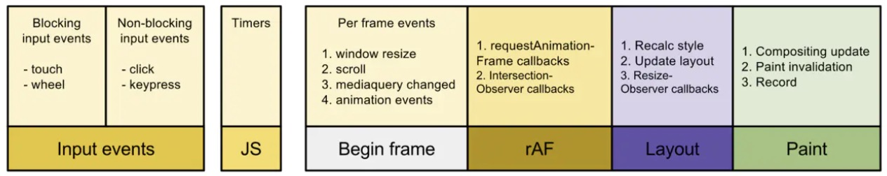

# 零散整理

### 协调/渲染 phase

这是React遍历组件树的阶段，并且：

- 更新状态和属性
- 调用生命周期钩子
- 获取组件的children
- 将它们与之前的children进行对比
- 并计算出需要执行的DOM更新

### requestIdleCallback

[using-requestidlecallback](https://developers.google.com/web/updates/2015/08/using-requestidlecallback)

很多时候 script 的执行会阻碍用户的一些行为交互，如何在不影响用户体验的同时执行不是优先级高的 work，an API that can help: requestIdleCallback。

注意区别：
requestAnimationFrame的回调会在每一帧确定执行，属于高优先级任务
而requestIdleCallback的回调则不一定，属于低优先级任务

> life of a frame

如果某一帧在16.67ms完成了上述任务的话，就有可能执行到 requestIdleCallback 的回调，如下图：

> requestIdleCallback actually fits into a typical frame

一些实践

通过上面的两张图可以看出，requestIdlCallback 的回调是在一帧执行完成所有的 work，如 layout、painting，如果要做一些 DOM 操作的话，需要到下一帧中执行。如这样的一个实践，在requestAnimationFrame callback中使用document fragment，在下一帧的requestAnimationFrame callback中才执行真正的 DOM 插入删除或者更新操作。同样的，VDOM 也是这样的原理来实践。

### Fiber Reconciler
* Ability to split interruptible work in chunks.
* Ability to prioritize, rebase and reuse work in progress.
* Ability to yield back and forth between parents and children to support layout in React.
* Ability to return multiple elements from render().
* Better support for error boundaries.

为了解决这些问题，React 不得不重新写为遍历树的算法，从依赖于内置堆栈的同步递归模型，变为具有链表和指针的异步模型。

递归模型的局限性：无法分解工作为增量单元，不能暂停特定组件的工作并在稍后恢复。

# recursing-on-children

[diff Algorithm](https://github.com/JTangming/blog/issues/17#issue-451191811)

# React Fiber Architecture

React Fiber 的目的是增强对类似动画、布局和手势操作这些场景的适应性。他的headline feature是增量渲染：将渲染工作拆分成块并将其分散到多个帧的能力。其他主要特性包括在新更新进来时能够暂定、取消或者重用；给不同更新分配优先级的能力；以及新的并发原函数。

知识预备：
- [理解Component&Element&Instance](./理解Component&Element&Instance.md)
- [Reconciliation](https://zh-hans.reactjs.org/docs/reconciliation.html)
- [React Design Principles](https://zh-hans.reactjs.org/docs/implementation-notes.html)

Fiber 要达成的目标：
- pause work and come back to it later.
- assign priority to different types of work.
- reuse previously completed work.
- abort work if it's no longer needed.

A fiber represents a unit of work

对于 React，我们可以用函数方式表示为：`v = f(d)`（这么类比有助于后文的理解）。如Javascript，跟踪程序执行的方式是使用 call stack（相关概念可以参考 event loop）。

UI 组件通常有复杂的业务逻辑，最终才返回 React Elements，这将比 functions 的执行有更多的副作用或者考虑。

那 React 怎么做？

基于以下两个API的启发：
- requestIdleCallback schedules a low priority function to be called during an idle period
- requestAnimationFrame schedules a high priority function to be called on the next animation frame.

但是基于这些 API，没法打断 rendering work into incremental units，如果使用既有的执行栈（call stack），程序会一直执行到栈空为止。

所以，React 实现了自己的 stack frame。
- 自定义执行栈的行为来优化渲染 UIs
- 随意打断执行栈并能手动处理相关操作（interrupt the call stack at will and manipulate stack frames manually）

好处是：能保持 stack frams 在内存中，以便能在任何时候操作执行。

除了执行栈的调度（scheduling），另外一些潜能是并发和错误边界（error boundaries）。

That's the purpose of React Fiber，a virtual stack frame。

A fiber corresponds to（对应） a stack frame, but it also corresponds to an instance of a component.

### Structure of a fiber

**type & key**
意图和React elements的一样，其实是直接copy于 Element。key 在 reconciliation 阶段用来确认 fiber 是否可以复用。

### Reference
- https://github.com/acdlite/react-fiber-architecture

Fiber === Virtual Stack Frame